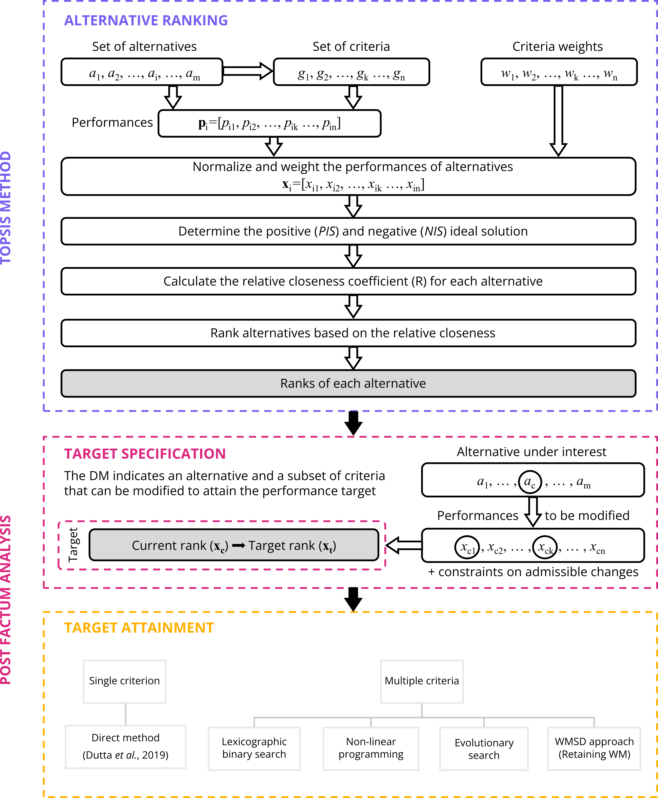

This repository contains the Python implementation of the post-factum analysis (PFA) framework for TOPSIS, as described in the paper *"Reaching the Top: A Comprehensive Framework for Post-Factum Analysis in TOPSIS."*  It provides tools to identify how to modify alternatives to improve their TOPSIS ranking. Specifically, the library offers five main post-factum analysis methods:
*   Direct method (single-criterion modification)
*   Lexicographic binary search
*   Non-linear programming
*   Evolutionary search (NSGA-II)
*   WM Retaining (preserving weighted mean).


# Table of contents
- [Table of contents](#table-of-contents)
- [Post-Factum Analysis TOPSIS-based ranking](#post-factum-analysis-topsis-based-ranking)
  - [Framework](#framework)
  - [Example dataset](#example-dataset)
  - [Post-factum analysis methods](#post-factum-analysis-methods)
    - [Direct method](#direct-method)
    - [Lexicographic binary search](#lexicographic-binary-search)
    - [Non-linear programming](#non-linear-programming)
    - [Evolutionary search](#evolutionary-search)
    - [WM Retaining](#wm-retaining)
- [Requirements](#requirements)
- [Installation](#installation)

# Post-Factum Analysis TOPSIS-based ranking

## Framework
The Technique for Order of Preference by Similarity to Ideal Solution (TOPSIS) is a multiple criteria decision making
method. It helps identify the best alternative by comparing the geometric distance of each option to the ideal and
negative-ideal solutions. Our library extends TOPSIS with a framework for post-factum analysis (PFA) that helps decision-makers
identify how to modify alternatives to improve their TOPSIS ranking. A schematic representation of the PFA framework is shown below.



In the following sections, we will demonstrate how to use the PFA framework to improve the ranking of a specific alternative in an example dataset.


## Example dataset

To explain how the library works, we will use a dataset that contains information about Special Economic Zones (SEZs) in Poland. These zones are designed to attract investors by offering favorable investment conditions, and are desribed by five criteria:
- **Total Area** (hectares; to be minimized): Represents the physical size of each SEZ. Efficient zones are compact and occupy less land.
- **Capital Expenditures** (billions PLN; to be minimized): Refers to the total investment required for the development and operation of an SEZ. Lower expenditures indicate higher efficiency.
- **Number of Jobs** (to be maximized): Measures employment opportunities generated within the SEZ. A key objective of SEZs is to create significant job opportunities.
- **Business Permits** (to be maximized): Denotes the number of permits issued to businesses operating in the SEZ, reflecting its attractiveness and activity level.
- **Financial Result** (billions PLN; to be maximized): Indicates the total revenue generated by companies within the SEZ, showcasing its economic success.

```python
import pandas as pd
from src.WMSDTransformer import WMSDTransformer

dataset = pd.read_csv("sez.csv", index_col=0)
preference_directions = ["cost", "cost", "gain", "gain", "gain"]
weights = np.array([6.06, 26.95, 20.02, 16.53, 30.44])
display(dataset)

wmsd_transformer = WMSDTransformer("R")
result_df = wmsd_transformer.fit_transform(
    X=dataset,
    weights=weights.tolist(),
    objectives=preference_directions,
    expert_range=None,
)
result_df = result_df.copy()
result_df["Rank"] = result_df["R"].to_numpy().argsort()[::-1].argsort() + 1
display(result_df.sort_values(by="Rank"))
```

|               Full Name | SEZ Code | Total Area [ha] | Capital Expenditures [B&nbsp;PLN] | Number of Jobs | Business Permits | Financial Result [B&nbsp;PLN] | R      | Rank |
| ----------------------: | -------: | --------------: | --------------------------------: | -------------: | ---------------: | ----------------------------: | ------ | ---: |
| Kostrzyn&#x2011;Słubice |      KOS |         2201.25 |                              7.13 |          32400 |              180 |                         22.98 | 0.7154 |    1 |
|              Tarnobrzeg |      TAR |         1868.21 |                              7.47 |          20740 |              195 |                         18.22 | 0.6241 |    2 |
|                  Mielec |      MIE |         1723.97 |                              7.84 |          34992 |              268 |                          4.96 | 0.5073 |    3 |
|                  Kraków |      KRA |          949.66 |                              4.24 |          29580 |              189 |                          1.37 | 0.4848 |    4 |
|                 Legnica |      LEG |         1341.15 |                              5.13 |          15294 |               86 |                          7.61 | 0.4359 |    5 |
|                  Słupsk |      SLU |          910.16 |                              1.59 |           3478 |               79 |                          0.76 | 0.4122 |    6 |
|                    Łódź |      LOD |         1754.64 |                             13.32 |          33401 |              209 |                          7.40 | 0.4114 |    7 |
|            Starachowice |      STA |          707.98 |                              1.79 |           6829 |               56 |                          0.70 | 0.4113 |    8 |
|      Kamienna&nbsp;Góra |      KAM |          540.83 |                              2.56 |           7530 |               60 |                          0.56 | 0.3980 |    9 |
|                 Pomorze |      POM |         2246.29 |                             10.48 |          24893 |              173 |                          1.48 | 0.3207 |   10 |


## Post-factum analysis methods
### Direct method

To demonstrate the use of the _Direct method_, we consider the Special Economic Zone in Legnica, which is currently ranked fifth.
By making changes to specific criteria, LEG has several opportunities to improve its position in ranking.
The decision-maker needs to decide which criterion is easiest to change based on available resources and priorities.

```python
alternative = "LEG"
target_rank = 2

wmsd_transformer.improvement("improvement_single_feature", alternative, target_rank, feature_to_change='Financial Result')
```
<div>
<table border="1" class="dataframe">
  <thead>
    <tr style="text-align: right;">
      <th></th>
      <th>Total Area</th>
      <th>Capital Expenditures</th>
      <th>Number of Jobs</th>
      <th>Business Permits</th>
      <th>Financial Result</th>
    </tr>
  </thead>
  <tbody>
    <tr>
      <th>0</th>
      <td>0.0</td>
      <td>0.0</td>
      <td>0.0</td>
      <td>0.0</td>
      <td>13.547401</td>
    </tr>
  </tbody>
</table>
</div>

LEG can improve its position in the ranking and move up to second place by improving its performance on a single criterion.
To do so, it must increase its Financial Result by 13.55 billion PLN.


### Lexicographic binary search

The lexicographic binary search method works by focusing on a list of criteria that the decision-maker identifies as changeable.
Initially, the method attempts to achieve the target by modifying the first criterion on the list.
If that doesn't lead to the desired results, the method moves on to the next criterion on the list.
Therefore, it's important for the decision-maker to carefully select and prioritize the criteria based on how easily they can be improved.

```python
alternative = "LEG"
target_rank = 2
criteria_permutation =  ['Number of Jobs', 'Business Permits', 'Financial Result']

wmsd_transformer.improvement("improvement_features", alternative, target_rank, features_to_change=criteria_permutation)
```
<div>
<table border="1" class="dataframe">
  <thead>
    <tr style="text-align: right;">
      <th></th>
      <th>Total Area</th>
      <th>Capital Expenditures</th>
      <th>Number of Jobs</th>
      <th>Business Permits</th>
      <th>Financial Result</th>
    </tr>
  </thead>
  <tbody>
    <tr>
      <th>0</th>
      <td>0.0</td>
      <td>0.0</td>
      <td>19698.0</td>
      <td>182.0</td>
      <td>1.54673</td>
    </tr>
  </tbody>
</table>
</div>


### Non-linear programming
The non-linear programming method works with a set of criteria without considering their order.
It uses a non-linear programming solver to directly achieve the desired target while following any additional requirements set by the decision-maker.
For example, if they consider a certain criterion unchangeable, it can be excluded by adding an appropriate constraint.
The solver finds a unique solution as long as the constraints do not reduce the set of possible solutions to an empty set.

```
alternative = "LEG"
target_rank = 1
criteria_permutation = ['Number of Jobs', 'Business Permits', 'Financial Result']

wmsd_transformer.improvement("improvement_non_linear_programming", alternative, target_rank, features_to_change=criteria_permutation)
```
<div>
<table border="1" class="dataframe">
  <thead>
    <tr style="text-align: right;">
      <th></th>
      <th>Total Area</th>
      <th>Capital Expenditures</th>
      <th>Number of Jobs</th>
      <th>Business Permits</th>
      <th>Financial Result</th>
    </tr>
  </thead>
  <tbody>
    <tr>
      <th>0</th>
      <td>0.0</td>
      <td>0.0</td>
      <td>12427</td>
      <td>108</td>
      <td>9.49</td>
    </tr>
  </tbody>
</table>
</div>

Legnica can reach the top rank by improving simultaneously on three criteria: Number of Jobs, Financial Result, and Business Permits.
To do so, 12 427 employees should be hired. In addition, 108 additional Business Permits should be issued, and the Financial Result should be improved by 9.45 billion PLN.


### Evolutionary search

The evolutionary method operates on a set of criteria without considering their order.
As a result, the decision maker obtains a set of Pareto optimal solutions that provides a comprehensive overview
of potential improvement strategies compared to remaining methods that yield a single solution.
Consequently, the decision maker is able to choose which of the solutions to apply in practice.


```python
alternative = "LEG"
target_rank = 2
popsize = 1000
n_generations = 200
criteria_permutation =  ['Number of Jobs', 'Business Permits', 'Financial Result']

wmsd_transformer.improvement(
    "improvement_genetic", alternative, target_rank, features_to_change=criteria_permutation,
    allow_deterioration=False, popsize=popsize, n_generations=n_generations, save_checkpoints=False
)[0].sample(10).sort_index()
```
<div>
<table border="1" class="dataframe">
  <thead>
    <tr style="text-align: right;">
      <th></th>
      <th>Total Area</th>
      <th>Capital Expenditures</th>
      <th>Number of Jobs</th>
      <th>Business Permits</th>
      <th>Financial Result</th>
    </tr>
  </thead>
  <tbody>
    <tr>
      <th>30</th>
      <td>0.0</td>
      <td>0.0</td>
      <td>6528.690775</td>
      <td>11.932883</td>
      <td>9.848312</td>
    </tr>
    <tr>
      <th>44</th>
      <td>0.0</td>
      <td>0.0</td>
      <td>702.662892</td>
      <td>62.235357</td>
      <td>9.894672</td>
    </tr>
    <tr>
      <th>54</th>
      <td>0.0</td>
      <td>0.0</td>
      <td>9231.498316</td>
      <td>95.387623</td>
      <td>5.858051</td>
    </tr>
    <tr>
      <th>67</th>
      <td>0.0</td>
      <td>0.0</td>
      <td>323.559041</td>
      <td>4.755171</td>
      <td>13.117419</td>
    </tr>
    <tr>
      <th>127</th>
      <td>0.0</td>
      <td>0.0</td>
      <td>8736.675186</td>
      <td>119.646806</td>
      <td>5.130533</td>
    </tr>
    <tr>
      <th>169</th>
      <td>0.0</td>
      <td>0.0</td>
      <td>230.100004</td>
      <td>140.862543</td>
      <td>7.355288</td>
    </tr>
    <tr>
      <th>461</th>
      <td>0.0</td>
      <td>0.0</td>
      <td>10016.941682</td>
      <td>126.869716</td>
      <td>4.565039</td>
    </tr>
    <tr>
      <th>475</th>
      <td>0.0</td>
      <td>0.0</td>
      <td>7887.791573</td>
      <td>24.992684</td>
      <td>8.790320</td>
    </tr>
    <tr>
      <th>798</th>
      <td>0.0</td>
      <td>0.0</td>
      <td>12091.754196</td>
      <td>176.371400</td>
      <td>3.071579</td>
    </tr>
    <tr>
      <th>875</th>
      <td>0.0</td>
      <td>0.0</td>
      <td>14218.100355</td>
      <td>79.823826</td>
      <td>4.868782</td>
    </tr>
  </tbody>
</table>
</div>


### WM Retaining

```python
alternative = "STA"
target_rank = 7
criteria_permutation = ['Total Area', 'Capital Expenditures', 'Number of Jobs', 'Business Permits', 'Financial Result']

wmsd_transformer.improvement(
    "improvement_non_linear_programming",
    alternative,
    target_rank,
    features_to_change=criteria_permutation,
    constant_WM=True
)
```
<div>
<table border="1" class="dataframe">
  <thead>
    <tr style="text-align: right;">
      <th></th>
      <th>Total Area</th>
      <th>Capital Expenditures</th>
      <th>Number of Jobs</th>
      <th>Business Permits</th>
      <th>Financial Result</th>
    </tr>
  </thead>
  <tbody>
    <tr>
      <th>0</th>
      <td>-2.113832</td>
      <td>0.003268</td>
      <td>-20.881441</td>
      <td>0.0</td>
      <td>0.009775</td>
    </tr>
  </tbody>
</table>
</div>


# Requirements

The library uses PySCIPOpt to determine exact WMSD boundaries quickly. If you use conda, you should be fine performing the follwoing command (easier option):
```console
conda install --channel conda-forge pyscipopt
``` 
If you use PyPI, then you will need a working installation of the [SCIP Optimization
Suite](https://www.scipopt.org/) (harder option, but might run faster). Please, make sure that your SCIP installation works, before installing WMSDTransformer. For more details on how to install SCIP, please refer to the [PySCIPOpt documentation](https://github.com/scipopt/PySCIPOpt/blob/master/INSTALL.md).

After installing PySCIPOpt (or if you already have SCIP installed), you can install the other dependencies by running:
```console
pip install -r requirements.txt
```


# Installation

<!-- ### From PyPI

This is the simplest (one-command) install method is to run the following command in your terminal:

```console
pip install WMSDtransformer
```

### From source -->

Once you have all the dependencies, you can install the library from source. To do so, clone the repository and run the following command in the root directory of the repository:

```console
pip install .
```


