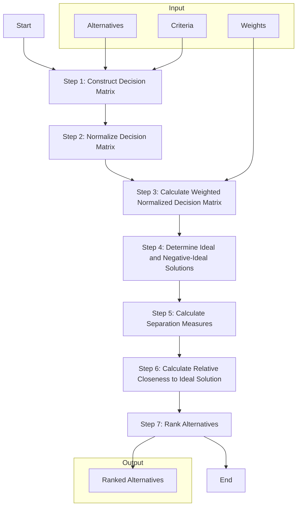
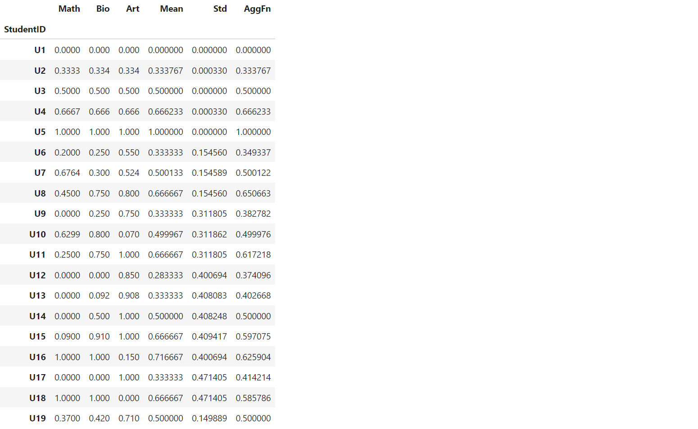
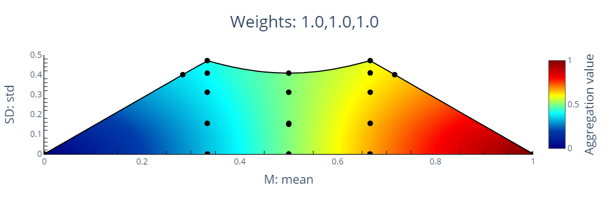

This repository hosts the code for **WMSDTransformer** - a scikit-learn compatible python library, that lets you create
TOPSIS rankings of alternatives, visualize rankings in WMSD space, and get recommendations on how to enhance the
performance of the alternative so that it can achieve a desired target.
<!-- Check out the project's [documentation](https://msdtransformer.readthedocs.io/en/latest/index.html) to learn more about using the WMSDTransformer.  -->


# Table of contents
- [Multiple criteria ranking based on TOPSIS method](#multiple-criteria-ranking-based-on-topsis-method)
  - [TOPSIS method](#topsis-method)
  - [Illustrative example](#illustrative-example)
- [Post-Factum Analysis TOPSIS-based ranking](#post-factum-analysis-topsis-based-ranking)
  - [Direct method](#direct-method)
  - [Lexicographic binary search](#lexicographic-binary-search)
  - [Non-linear programming](#non-linear-programming)
  - [Evolutionary search](#evolutionary-search)
  - [WMSD-based method](#wmsd-based-method)
- [Installation](#installation)
- [Requirements](#requirements)
- [Citation](#citation)

# Multiple criteria ranking based on TOPSIS method


## TOPSIS method

The Technique for Order of Preference by Similarity to Ideal Solution (TOPSIS) is a multiple criteria decision making
method. It helps identify the best alternative by comparing the geometric distance of each option to the ideal and
negative-ideal solutions.




## Illustrative example

| Full Name               | SEZ Code |  Total Area [ha] |   Capital Expenditures [B&nbsp;PLN] |    Number of Jobs |  Business Permits   |   Financial Result [B&nbsp;PLN] | R      | Rank |
|------------------------:|---------:|-----------------:|------------------------------------:|------------------:|--------------------:|--------------------------------:|-------:|-----:|
| Kostrzyn&#x2011;Słubice | KOS      | 2201.25          | 7.13                                | 32400             | 180                 | 22.98                           | 0.7154 | 1    |
| Tarnobrzeg              | TAR      | 1868.21          | 7.47                                | 20740             | 195                 | 18.22                           | 0.6241 | 2    |
| Mielec                  | MIE      | 1723.97          | 7.84                                | 34992             | 268                 | 4.96                            | 0.5073 | 3    |
| Kraków                  | KRA      | 949.66           | 4.24                                | 29580             | 189                 | 1.37                            | 0.4848 | 4    |
| Legnica                 | LEG      | 1341.15          | 5.13                                | 15294             | 86                  | 7.61                            | 0.4359 | 5    |
| Słupsk                  | SLU      | 910.16           | 1.59                                | 3478              | 79                  | 0.76                            | 0.4122 | 6    |
| Łódź                    | LOD      | 1754.64          | 13.32                               | 33401             | 209                 | 7.40                            | 0.4114 | 7    |
| Starachowice            | STA      | 707.98           | 1.79                                | 6829              | 56                  | 0.70                            | 0.4113 | 8    |
| Kamienna&nbsp;Góra      | KAM      | 540.83           | 2.56                                | 7530              | 60                  | 0.56                            | 0.3980 | 9    |
| Pomorze                 | POM      | 2246.29          | 10.48                               | 24893             | 173                 | 1.48                            | 0.3207 | 10   |


# Post-Factum Analysis TOPSIS-based ranking

## Direct method
## Lexicographic binary search
## Non-linear programming
## Evolutionary search
## WMSD-based method


# Requirements

WMSDTransformer uses PySCIPOpt to determine exact WMSD boundaries quickly. If you use conda, you should be fine performing the follwoing command (easier option):
```console
conda install --channel conda-forge pyscipopt
``` 
If you use PyPI, then you will need a working installation of the [SCIP Optimization
Suite](https://www.scipopt.org/) (harder option, but might run faster). Please, make sure that your SCIP installation works, before installing WMSDTransformer. For more details on how to install SCIP, please refer to the [PySCIPOpt documentation](https://github.com/scipopt/PySCIPOpt/blob/master/INSTALL.md).

After installing PySCIPOpt (or if you already have SCIP installed), you can install the other dependencies by running:
```console
pip install -r requirements.txt
```


# Installation

<!-- ### From PyPI

This is the simplest (one-command) install method is to run the following command in your terminal:

```console
pip install WMSDtransformer
```

### From source -->

Once you have all the dependencies, you can install WMSDTransformer from source. To do so, clone the repository and run the following command in the root directory of the repository:

```console
pip install .
```


# Quickstart

```python
import pandas as pd
from WMSDTransformer import WMSDTransformer

df = pd.read_csv("../data/students.csv", sep=';', index_col= 0)
students_transformer = WMSDTransformer("R") # Relative distance
students_transformer.fit(df, expert_range=[[0,100],[1,6],[1,6]])
students_transformer.transform(df)
```



```python
students_transformer.show_ranking()
```


```python
students_transformer.plot()
```




# Google Colab notebooks

You can learn about our library using one of those notebooks in Google Colab:
https://colab.research.google.com/drive/1umFWSW7hMTGI-3br8GUzaYYSIAADBj6p?usp=sharing
https://colab.research.google.com/drive/1UvjUU6iUpkm0oiwi8v-Stn8lVxnAIpvX?usp=sharing
https://colab.research.google.com/drive/1UiyJOv11c0YlMctPCSQ7-wZfGVvCixPH?usp=sharing
https://colab.research.google.com/drive/1qzZ2g18oR9l2abD16SDbZRx1LoCl33sh?usp=sharing


# Citation

If you use this project in your research, please consider citing the following papers:

- [Susmaga, R. *et al.* (2023) MSD-space: Visualizing the inner-workings of TOPSIS aggregations. *European Journal of Operational Research*, 308(1), 229-242.](https://doi.org/10.1016/j.ejor.2022.12.003)
- [Susmaga, R. *et al.* (2023) Towards Explainable TOPSIS: Visual Insights into the Effects of Weights and Aggregations on Rankings. Arxiv preprint.](
https://doi.org/10.48550/arXiv.2306.07706)

